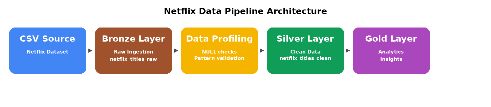

# 🎬 Netflix Data Standardization Pipeline

## 📌 Project Overview

This project demonstrates a SQL Server-based data engineering pipeline to ingest, profile, clean, and analyze Netflix catalog data.

The raw dataset was loaded into SQL Server and transformed into an analytics-ready clean layer by standardizing date formats and decomposing mixed-format duration fields into structured attributes.

---

## 🎯 Business Objective

The goal was to convert raw Netflix content metadata into a clean dataset that can support business questions such as:

- How many Movies vs TV Shows are available?
- How has content growth changed over time?
- What is the average movie runtime?
- How many seasons do TV shows typically have?

---

## 🛠️ Tech Stack

- SQL Server
- SQL Server Management Studio (SSMS)
- SQL (Data Cleaning & Transformation)
- Git & GitHub
- Kaggle Netflix Dataset

---

## ⚙️ Data Processing Steps

1. **Raw Ingestion**
   - Loaded CSV data into SQL Server (`netflix_titles_raw`)

2. **Data Profiling**
   - Identified NULL values across key columns
   - Checked data format inconsistencies

3. **Data Cleaning & Transformation**
   - Converted `date_added` from text to `DATE`
   - Split `duration` into:
     - `duration_value` (numeric)
     - `duration_unit` (standardized categorical field)
   - Standardized categorical values (`Season` and `Seasons` → `season`)

4. **Validation**
   - Verified row counts between raw and clean tables
   - Ensured transformation accuracy

5. **Analytics Layer**
   - Built queries to derive business insights

---

## 📊 Data Pipeline Architecture

---

## 📈 Key Insights

- Total records processed: **8807**
- Movies: **6131**
- TV Shows: **2676**
- Average movie duration: **~99 minutes**
- Average TV show duration: **~1 season**
- Content growth peaked between **2019–2020**

---

## 🚀 Future Improvements

- Normalize `country` into a separate dimension table
- Normalize `listed_in` (genres) into structured tables
- Automate ingestion using Python scripts
- Add orchestration using Airflow

---

## 💡 Key Takeaway

This project highlights how raw, unstructured data can be transformed into a clean and analytics-ready dataset using data modeling, standardization, and SQL-based transformation techniques.
