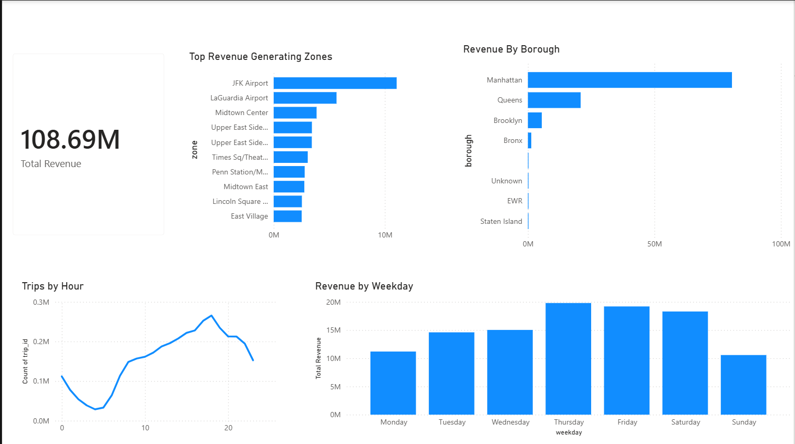

# 🚕 NYC Taxi Data Modeling & Analytics (Week 02)

## 📌 Project Overview
This project focuses on building a **data model and analytical dashboard** using NYC Taxi trip data (January 2026).

The objective was to simulate a **real-world data engineering workflow**:
- Transform raw data into structured datasets
- Design fact and dimension tables
- Generate business insights using Power BI

## 🏗️ Data Architecture

This project follows a **medallion-style architecture**:

### 🔹 Raw Layer (Bronze)
- `yellow_tripdata_2026-01.parquet`
- `taxi_zone_lookup.csv`

### 🔹 Processed Layer (Silver)
- `dim_location.csv`
- `dim_time.csv`
- `fact_trips.csv

  ### 🔹 Output Layer (Gold)
- `revenue_by_borough.csv`
- `revenue_by_weekday.csv`
- `trips_per_hour.csv`
- `top_pickup_zones.csv`
- `avg_trip_distance_per_day.csv`

## 🏗️ ETL Pipeline Architecture

```mermaid
flowchart LR

    subgraph SRC["Source Layer"]
        S1["yellow_tripdata_2026-01.parquet"]
        S2["taxi_zone_lookup.csv"]
    end

    subgraph EXT["Extract"]
        E1["Load raw trip data"]
        E2["Load taxi zone lookup"]
    end

    subgraph TRN["Transform"]
        T1["build_dim_location.py"]
        T2["build_dim_time.py"]
        T3["build_fact_trips.py"]
        T4["business_queries.py"]
    end

    subgraph STG["Structured Data Layer"]
        D1["dim_location.csv"]
        D2["dim_time.csv"]
        F1["fact_trips.csv"]
    end

    subgraph CUR["Curated Analytics Output"]
        O1["revenue_by_borough.csv"]
        O2["revenue_by_weekday.csv"]
        O3["trips_per_hour.csv"]
        O4["top_pickup_zones.csv"]
        O5["avg_trip_distance_per_day.csv"]
    end

    subgraph BI["Consumption Layer"]
        B1["Power BI Dashboard"]
    end

    S1 --> E1
    S2 --> E2

    E1 --> T2
    E1 --> T3
    E2 --> T1

    T1 --> D1
    T2 --> D2
    T3 --> F1

    D1 --> T4
    D2 --> T4
    F1 --> T4

    T4 --> O1
    T4 --> O2
    T4 --> O3
    T4 --> O4
    T4 --> O5

    D1 --> B1
    D2 --> B1
    F1 --> B1
    O1 --> B1
    O2 --> B1
    O3 --> B1
    O4 --> B1
    O5 --> B1


## ⚙️ Technologies Used
- Python (Pandas)
- Data Modeling (Fact & Dimension Tables)
- Power BI
- Parquet & CSV

  ## 📊 Dashboard



### Key Insights:
- Manhattan generates the highest revenue
- Airport zones (JFK, LaGuardia) are major contributors
- Peak trip demand occurs during evening hours (5 PM – 8 PM)
- Revenue is highest between Thursday and Saturday

  ## 📥 Dataset Source

NYC Taxi Data (January 2026)  
https://www.nyc.gov/site/tlc/about/tlc-trip-record-data.page

## 🚀 Learning Outcomes

- Designed a dimensional data model (Fact & Dimension Tables)
- Built an ETL pipeline using Python
- Created a business-driven analytics dashboard
- Simulated a real-world data engineering project workflow


